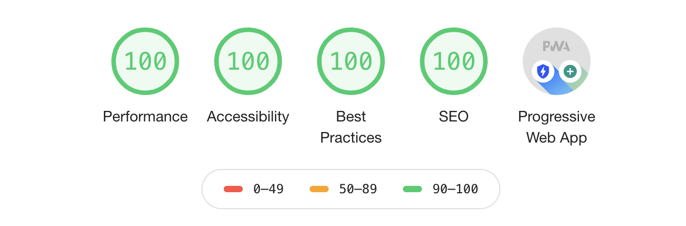

# React boilerplate app

You can find the app running here in [webapp-boilerplate](https://next-boilerplate-delta.vercel.app/)

Example NextJS app containing:

- Typescript (https://www.typescriptlang.org/)
- NextJS (https://nextjs.org/docs)
- React (https://react.com/)
- Emotion Css (https://emotion.sh/docs/introduction)
- Rosetta (i18n) (https://github.com/lukeed/rosetta)
- Dockerised app (https://www.docker.com/)
- ESLINT (https://eslint.org/)
- Prettier (https://prettier.io/)
- StateManagement with side-effects (https://github.com/davidkpiano/useEffectReducer)
- PWA (https://web.dev/progressive-web-apps/)
- Page + Api routing, including healthchecks
- NextJS with custom webpack config
- Custom import urls using webpack alias (~/...)

## Lighthouse stats

